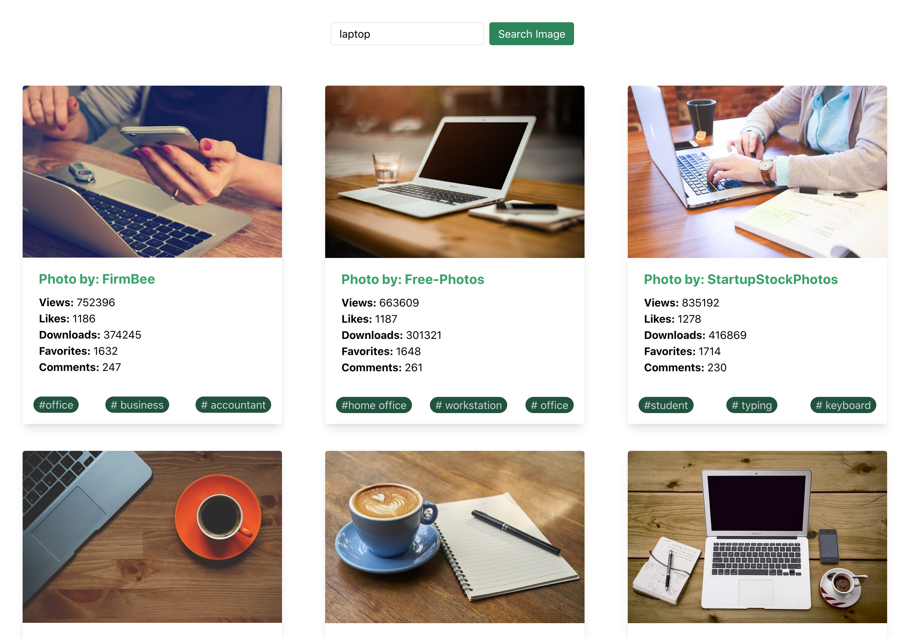

# Image Gallery App

---

### About:

This is an Image Gallery App where you search any thing in search bar then the related photos will be displayed.

## Technoloogies used:

- React
- useState Hooks
- TailwindCSS
- Git

## Software used in this Project:

- Visual Studio Code
- GitHub
- Google Chrome Developer Tools

## How to use it:

- Please download or clone the repository
- In the App dirctory, run this command (npm install)
- Sing un in https://pixabay.com to get the API key
- Update the API key in main.js file
- In terminal type npm start and run it

## Developed by:

Alam Talash
https://alamtalash.com

#### Date: July 17, 2020
